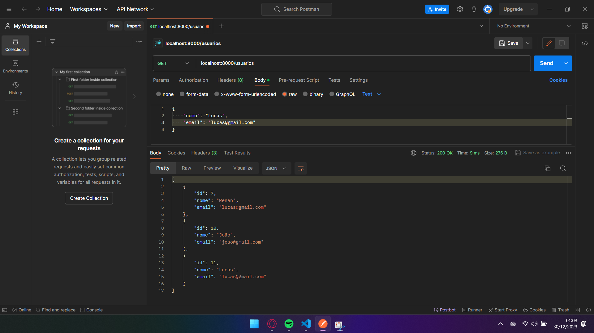
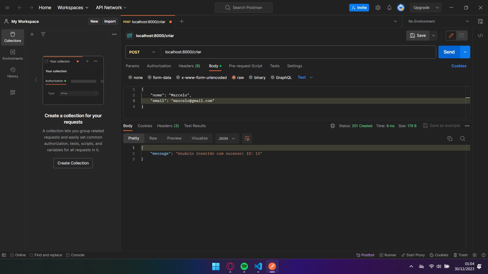
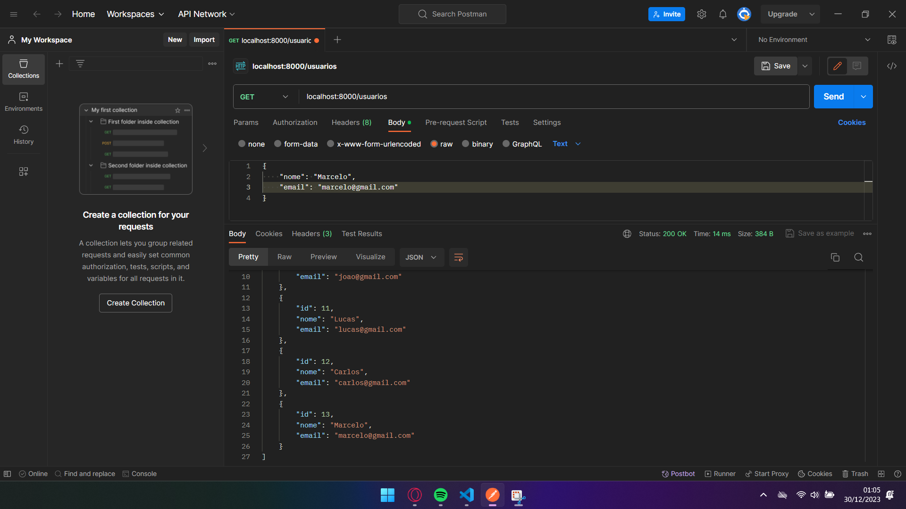
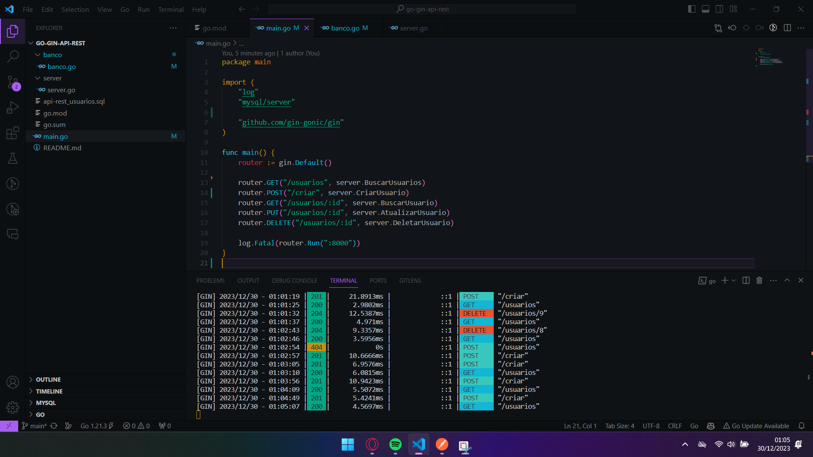

# CRUD API with Go and Gin

Welcome to my CRUD API project, built with Go and Gin! This project demonstrates a simple yet powerful CRUD (Create, Read, Update, Delete) API for managing user data in a MySQL database.

## Features

- **Create:** Add new users to the database.
- **Read:** Retrieve a list of all users or a specific user by ID.
- **Update:** Modify user information based on the provided ID.
- **Delete:** Remove a user from the database.

## Technologies Used

- [Go](https://golang.org/): The programming language used for server-side development.
- [Gin](https://gin-gonic.com/): A web framework written in Go for building APIs.
- [MySQL](https://www.mysql.com/): The database used for storing user information.

## Getting Started

1. **Clone the repository:**
   ```bash
   git clone https://github.com/Renan-Parise/go-gin-api-rest.git
   cd awesome-crud-api

2. **Install dependencies:**
   ```bash
   go mod download

3. **Set up the MySQL database:**
   ```bash
   You must install the database in the folder and edit the "banco.go" file with your MySQL credentials.

3. **Run the application:**
   ``` go run main.go

   The API will be accessible at http://localhost:8000.




